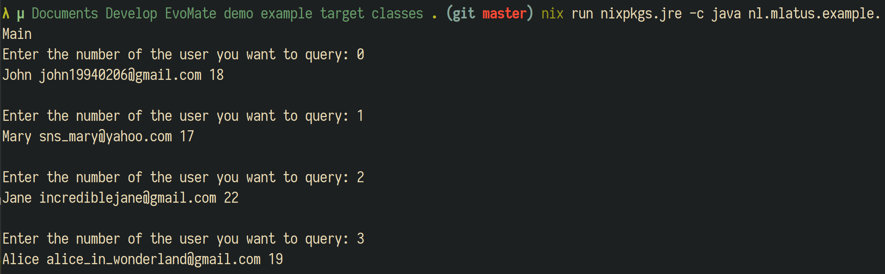
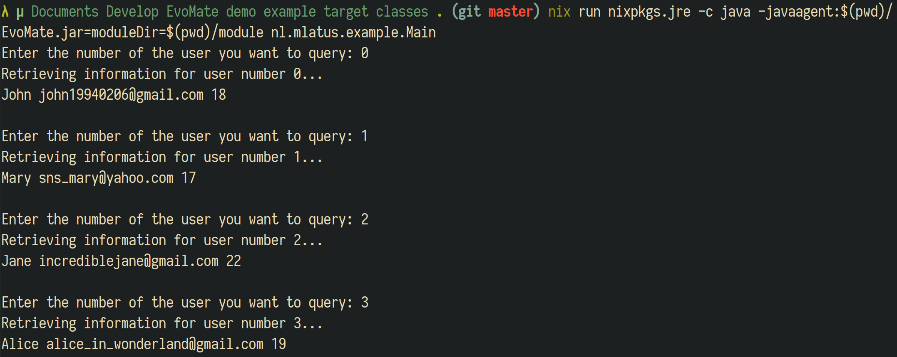
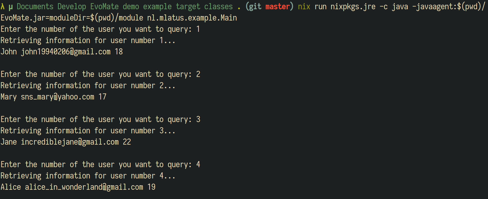
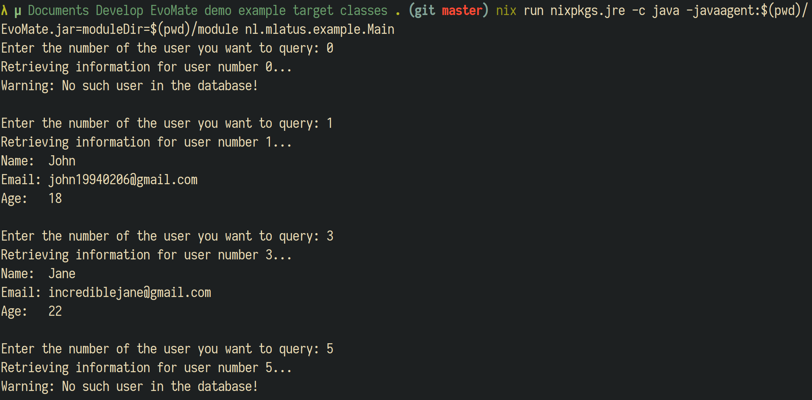

# Introduction

EvoMate, a tool which serves as a general extension system for Java programs.
It makes use of the "Java Agent" mechanism provided by Java Virtual Machine(JVM) to modify the loaded class file on the fly, to inject additional logic into original methods.

# How to Get

```sh
git clone https://github.com/Ninlives/EvoMate
mvn package
```

You should see the `EvoMate.jar` in the `target` directory.

# Usage

## Demo

You can find the source code of these demos [here](demo).

### The Program

Here is a simple program for querying information of users by their position in the database, counting from 0.
For example, if user input "0", the information of the first user in the database will be printed.



For simplicity, the "database" is just a static array contains a list of `User` objects.

```java
package nl.mlatus.example;

public class Data {
    static User[] users = {
            new User("John", "john19940206@gmail.com", 18),
            new User("Mary", "sns_mary@yahoo.com", 17),
            new User("Jane", "incrediblejane@gmail.com", 22),
            new User("Alice", "alice_in_wonderland@gmail.com", 19),
    };

    private static User getUser(int serialNumber){
        return users[serialNumber];
    }

    public static void printUser(int serialNumber){
        System.out.println(getUser(serialNumber));
    }
}
```

A `User` object contains information about `name`, `email` and `age` of a user.

```java
package nl.mlatus.example;

public class User {
    private String name;
    private String email;
    private int    age;

    public User(String name, String email, int age) {
        this.name = name;
        this.email = email;
        this.age = age;
    }

    public String getName() {
        return name;
    }

    public String getEmail() {
        return email;
    }

    public int getAge() {
        return age;
    }

    @Override
    public String toString(){
        return String.format("%s %s %d", name, email, age);
    }
}
```

The `main` method repeatedly receive a number as input, then invoke `Data.printUser` to print information of the corresponding user:

```java
package nl.mlatus.example;

public class Main {
    public static void main(String[] args) {
        Scanner input = new Scanner(System.in);
        while (true){
            try {
                System.out.print("Enter the number of the user you want to query: ");
                Data.printUser(input.nextInt());
                System.out.println();
            } catch (InputMismatchException e){
                System.err.println("The input is not a valid number!");
                input.nextLine();
            }
        }
    }

}
```

### The Plug-in

If the above program did not satisfy your requirement, but you do not want to modify the source code directly, you could make use of `EvoMate` and create a plug-in to modify the logic of the original program.

Every plug-in should contain at least one class called "class handler" that extends `ClassHook` and override the `handleClass` method, this method is responsible for determine which class and method should be injected.
See this example:

```java
package nl.mlatus.plugin;

public class Entry extends ClassHook {
    @Override
    public void handleLoadClass(LoadClassParam param) {
        //Implementation
    }
}
```

Plug-in should be released as a jar package, and the `MANIFEST.MF` should have an entry called `Advice-Module`, its value should be set to the name of the class handler, so `EvoMate` knows which class it should look for.
The `MANIFEST.MF` of this plug-in looks like this:

```
Manifest-Version: 1.0
Archiver-Version: Plexus Archiver
Created-By: Apache Maven
Built-By: mlatus
Build-Jdk: 11.0.4
Advice-Module: nl.mlatus.plugin.Entry
```

The value of `Advice-Module` may contain multiple classes, separated with white spaces.

So, how can I inject my code?
First, you should check whether the target class is being loaded.
Every time a class is about to be loaded, `EvoMate` calls `handleClass` method of each known class handlers with a `LoadClassParam` object.
This object contains the information about the name and the corresponding class loader of the class.
Normally, the plug-in should check if the classname is equal to its target, then invoke `hookMethod` to do the real injection:

```java
public void handleLoadClass(LoadClassParam param) {
    switch (param.getClassName()){
        case "nl.mlatus.example.Data":
            hookMethod(param, DataHook.class, "printUser", int.class);
            break;
    }
}
```

The second parameter of `hookMethod` is a class that contains the custom code that will be injected into the target method.
The third parameter is the name of the target method, followed with a list of `Class` objects or `String` representing the parameter types of the target method.
These `String` should be the canonical name of the corresponding class type(e.g., you can use either `Date.class` or `"java.util.Date"`).

The custom logic that you wish to inject should be implemented in a separate class.
For example, users may expect some response from the program indicating their input is successfully accepted.
The demo program does not provide such functionality, which can be added by this plug-in.
In the `DataHook`, which is used to inject code into the `printUser` method, create this function:

```java
public class DataHook {
    @BeforeCall
    public static void processBeforeExecution(MethodHookParam param){
        System.out.printf("Retrieving information for user number %d...%n", (int)param.args[0]);
    }
}
```

Let me explain what happened here.
`EvoMate` supports inject custom code into three types of positions:

- A method annotated with `@BeforeCall` will be called before the execution of the target method when it is invoked.
- A method annotated with `@AfterReturn` will be called when the target method successfully returns.
- A method annotated with `@AfterThrow` will be called when the target method throws an error.

Methods annotated with above annotations must accept a `MethodHookParam` object as its parameter.
This object contains the information about the invocation when the this method is called during the invocation of the target method:

- `param.thisObject` is the object that invokes the target method, or null if target method is static.
- `param.args` is an array of `Object` containing parameters passed to target method.
- `param.getResult()` returns the value returned by the target method, if it has returned successfully, otherwise it returns `null`. This value can be replaced by `param.setResult`.
- `param.getThrowable()` returns the `Throwable` object thrown by the target method, if is has thrown an error, otherwise it returns `null`. This object can be replaced by `param.setThrowable`.

Thus, the method `processBeforeExecution` shown in the example will be called every time `printUser` is invoked.
And before `printUser` is actually executed, it prints some message to inform the user that it is trying to query the database.

Build and package the plug-in as a jar, we can now load this plug-in into the demo program.
Before starting the demo program, add these option to jvm:

> -javaagent:<path/to/EvoMate.jar>=moduleDir=<path/to/directory/containing/plugin.jar>

Let's see what will happen:



In addition to add some custom logic, `EvoMate` provides some extra ability to affect the behavior of the target method.
For instance, counting from 0 is unnatural for many users, they want to count from 1.
This can be achieved by changing the parameter passed to `printUser`:

```java
public class DataHook {
    @BeforeCall
    public static void processBeforeExecution(MethodHookParam param){
        System.out.printf("Retrieving information for user number %d...%n", (int)param.args[0]);
        param.args[0] = (int)param.args[0] - 1;
    }
}
```

Parameters passed to target method can be changed by modifying the content of `param.args`.
Rebuild the plug-in and load again to see if the changes have taken effect:



The demo program did not check if the input value is out of range.
Therefore, `ArrayIndexOutOfBoundsException` may be thrown by `printUser` and that is not handled.
Put this function in `DataHook` to help the program correctly handle invalid inputs:

```java
public class DataHook {
    @BeforeCall
    public static void processBeforeExecution(MethodHookParam param){
        System.out.printf("Retrieving information for user number %d...%n", (int)param.args[0]);
        param.args[0] = (int)param.args[0] - 1;
    }

    @AfterThrow
    public static void handelIndexOutOfBound(MethodHookParam param){
        if(param.getThrowable() instanceof ArrayIndexOutOfBoundsException){
            System.err.println("Warning: No such user in the database!");
            param.returnEarly();
        }
    }
}
```

`param.returnEarly()` forces the target method return the value of `param.getResult()`, or simply return if it is a `void` method.
If you want to changed the returned value, use `param.setResult` instead.
If any of these method is invoked before the target method actually executes (i.e. invoked in methods annotated with `@BeforeCall`), the execution of the target method will be skipped.
`param.setThrowable` has similar functionality, but it will force the target method to throw a `Throwable` object instead.

Let's another patch for the demo.
Currently the program just prints all information of user separated by white space, which looks obscure.
We'd like to inject the `toString` method of class `User` to get a better formatted message.

First add an entry:
```java
public class Entry extends ClassHook {
    @Override
    public void handleLoadClass(LoadClassParam param) {
        switch (param.getClassName()){
            case "nl.mlatus.example.Data":
                hookMethod(param, DataHook.class, "printUser", int.class);
                break;
            case "nl.mlatus.example.User":
                hookMethod(param, UserHook.class, "toString");
                break;
        }
    }
}
```

Add the Implementation:
```java
public class Entry extends ClassHook {
    @Override
    public void handleLoadClass(LoadClassParam param) {
        switch (param.getClassName()){
            case "nl.mlatus.example.Data":
                hookMethod(param, DataHook.class, "printUser", int.class);
                break;
            case "nl.mlatus.example.User":
                hookMethod(param, UserHook.class, "toString");
                break;
        }
    }
}
```

Rebuild and load the plug-in, this is what the program looks now:


